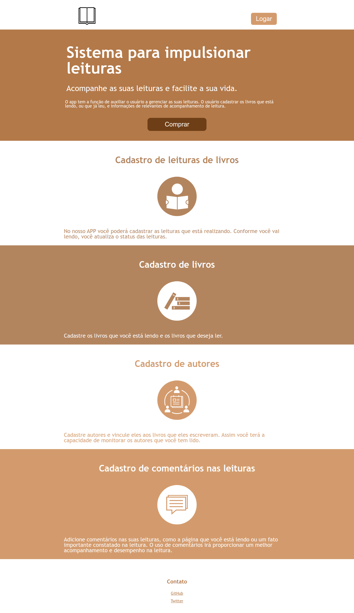

## Descrição

Aplicação desenvolvida com Spring MVC 4 com JSP e JSTL para uma página de apresentação sobre um produto fictício. A principal intenção é praticar.

A tela foi desenvolvida com Mobile First.

Os textos utilizados para preencher a tela foram elaborados da forma mais básica possível, sem nenhum compromisso de serem relevantes, coesos, etc.

Eu não quis utilizar fotos. Apenas os ícones.

## Tela

## Ambiente

**Servidores testados**: Tomcat 7, Tomcat 8.0,  Tomcat 8.5

**JRE**: Java 8

**Gerenciar de Dependências**: Maven

## Deploy

1. Exportar o projeto para um arquivo `.war`
2. Colocar o arquivo `.war` exportado na pasta `webapps` do Tomcat
3. Iniciar o Tomcat
4. Acessar o endereço do servidor tomcat com o mesmo nome do arquivo - http://servidor/nome-da-aplicacao

## Fontes dos icones

As fontes dos ícones foram extraídas do site [The Noun Project](https://thenounproject.com/).
